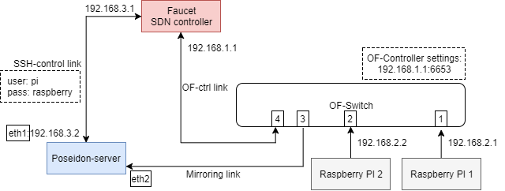

# Poseidon with Faucet
This example shows how can you run Poseidon with Faucet controller. 
Motivated by Charlie blog [here](https://blog.cyberreboot.org/building-a-software-defined-network-with-raspberry-pis-and-a-zodiac-fx-switch-97184032cdc1),
this is example show detailed technical steps that I learned when I followed Charlie's blog. 
## Setup demo environment 

## Hardware
- One OF-switch (in my case ovs on TP-Link router) 
- Three raspberry Pis (one will run Faucet controller, and two will run as hosts)
- One Host (PC, laptop) to run as Poseidon server. 
## Settings
Connect these devices as shown in the figure above.
### Faucet PI
- Install [Docker CE](https://docs.docker.com/engine/installation/linux/docker-ce/debian/) 
- Build and run faucet container
```
git clone https://github.com/faucetsdn/faucet
cd faucet
docker build -f Dockerfile.pi -t faucet/faucet .
docker run -dit --name faucet-pi --restart unless-stopped faucet/faucet
```
- Enable ssh on Faucet PI as in [here](https://www.raspberrypi.org/documentation/remote-access/ssh/). Give pi user permission to change faucet.yaml and log files, such that Poseidon can edit these files later. 
```
sudo chmod auo+w /etc/ryu/faucet/faucet.yaml
sudo chmod -R auo+w /var/log/ryu/faucet/
```
- Configuring network interfaces of Faucet Pi. Edit file interfaces (/etc/network/interfaces) as:
```
auto eth0
iface eth0 inet static
    address 192.168.1.100
    
auto eth1
iface eth1 inet static
    address 192.168.3.1
```
- Configure /etc/ryu/faucet/faucet.yaml
Change dp_id (switch MAC without colons), and hardware values to match your case. 
```
vlans:
  demo:
    vid: 300
  mirror:
    vid: 101
    max_hosts: 0
dps:
  openwrt:
    dp_id: 0x14cc20be86aa
    hardware: "Open vSwitch"
    proactive_learn: true
    interfaces:
      1:
        native_vlan: demo
      2:
        native_vlan: demo
      3:
        native_vlan: mirror
```
## Poseidon server
